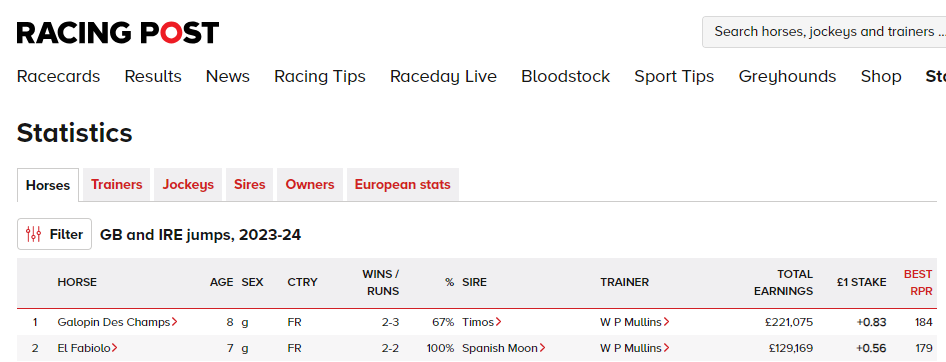
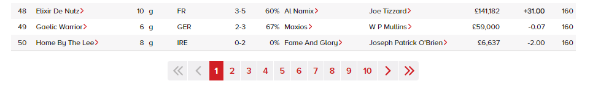
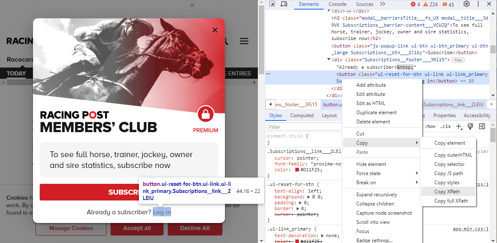
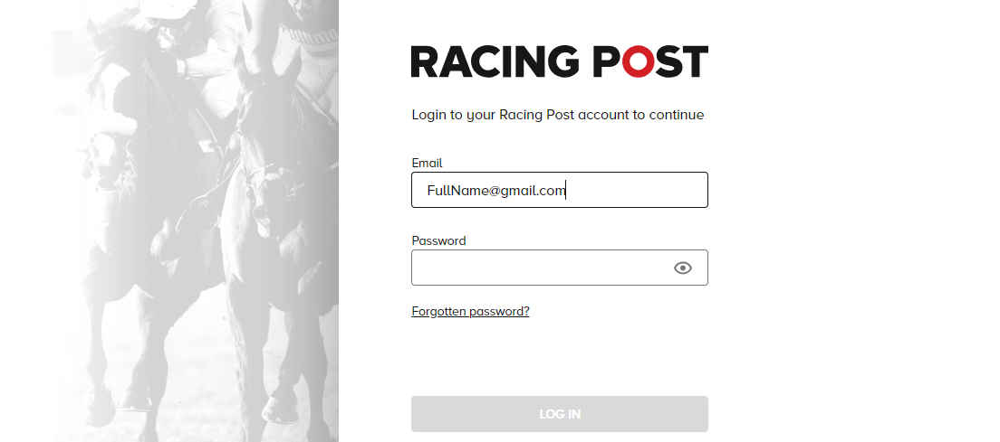
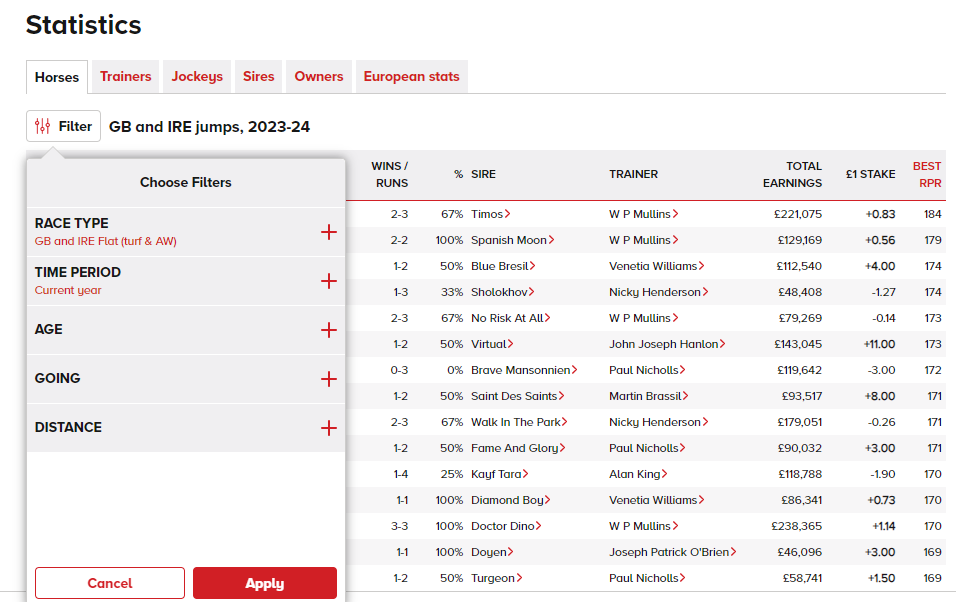
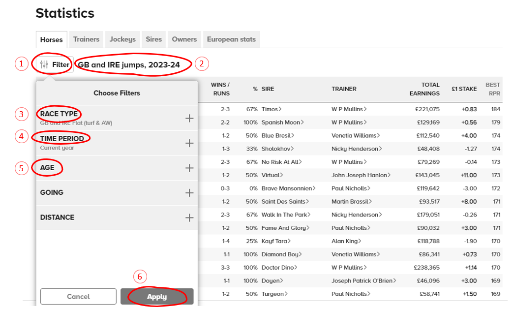
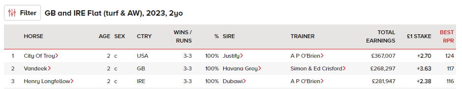

Webscrapping Horse Racing Data
================
Colin Fives
17 February 2024

### Background

The goal of this project is to scrape the latest race horse stats from
the [racing post](https://www.racingpost.com/) website. The site’s
statistics page displays a table which contains the name of the horse,
it’s age, sex, nationality, the ratio of wins to runs, the horse’s sire,
it’s trainer, it’s total earnings and most importantly the horse’s “Best
RPR”. The RPR (ie. Racing Post Rating) is a score calculated by the
organisation which is based on a horse’s racing ability in relation to
the weight carried i.e. if horse X beats horse Y carrying the same
weight then it is awarded a higher rating. Extracting this information
in bulk is very useful for assessing the top performers for a given
season.

<figure>

<figcaption aria-hidden="true"><em>Screen shot from racing post
statistics page</em></figcaption>
</figure>

### Set up

For this project, I decided to experiment with the package
[RSelenium](https://cran.r-project.org/web/packages/RSelenium/index.html)
for it’s capability of browser automation. The racing post statistics
page only displays 50 results per webpage and has 100s of pages the user
must click through under the table. A remote driver such as Rselenium is
useful in this scenario as it can be set up to click the next button
automatically and extract the data on each, consecutive page.

<figure>

<figcaption aria-hidden="true"><em>Screen shot from racing post
statistics page</em></figcaption>
</figure>

<br> To use Rselenium, ensure the latest version of your web browser is
installed (in this case, I’ll be using Google Chrome) and download the
corresponding WebDriver for that version. A WebDriver is a browser
automation framework that accepts commands and sends them to a browser.
The WebDriver requires Java to function so this will also have to be
installed.

### Code - Extraction

First we must check that the correct version of Java is installed.

``` r
if(Sys.getenv("JAVA_HOME")!=""){
  Sys.setenv(JAVA_HOME="")
}

# Java Set up
Sys.setenv(JAVA_HOME='C:/Program Files/Java/jre-1.8') # set environment variables 
system("java -version") # check status
Sys.getenv("JAVA_HOME") # check correct path is set
```

Then we load the relevant libraries that will be used throughout the
entire report.

``` r
#load relevant libraries
library(rvest)
library(dplyr)
library(XML)
library(RSelenium)
library(rJava)
options(stringsAsFactors = FALSE)
library(wdman)
library(knitr)
```

Now we take a look at the chrome driver:

``` r
# # VERSION OF CHROME
binman::list_versions("chromedriver") # ensure to update chrome driver so that it aligns with version of chrome

# Download binaries, start driver, and get client object.
# ensure to change port if running into issues
# Make connection 
chromeDr = chrome(version="120.0.6099.109", retcommand = TRUE)
chromeDr # just so you can see what the command that is being run looks like
chromeDr = chrome(version="120.0.6099.109", retcommand = FALSE)
```

The next step is to create an RSelenium rsClientServer with Google
Chrome browser, specify the URL and navigate to the page.

``` r
# start a chrome browser
rD <- rsDriver(browser=c("chrome")) 
remDr <- rD[["client"]]  # remote driver object

# set website URL
my_url <- "https://www.racingpost.com/statistics/"

# Navigate to page.
remDr$navigate(my_url)
```

After running this code, the Chrome window controlled by RSelenium will
open the chosen site.

<figure>

<figcaption aria-hidden="true"><em>Screen shot from racing post
statistics page</em></figcaption>
</figure>

<br> The statistics page is hidden behind a pay wall so I will feed the
driver my credentials so that it can access the site. In order for the
driver to access the login page, I also need to specify where the ‘log
in’ button is. This is where the method `driver$findElement()` comes in
handy and enables the driver to search for an element on the page using
either the `xpath` or `css selector`. I chose to pick the `xpath` of the
log in button element which can be acquired by right clicking on the
link and choosing the *inspect* option. This will open the DOM panel and
show its HTML code where the `xpath` can be copied from.

<figure>

<figcaption aria-hidden="true"><em>Screen shot from racing post
statistics page</em></figcaption>
</figure>

<br> Now that we have the `xpath` of the log in button element, we can
create a webElement object called `sign_btn` and use the method
`sign_btn$clickElement()` to click the log in link and send us to the
page. In a similar fashion, we can find the username and password
elements using their `xpath` and then use the various methods at our
disposal to store them as webElement objects, clear any previous
contents and plug in the relevant credentials (the username and password
below are of course dummy examples ;) ). It’s good practice to use
`Sys.sleep()` in order to suspend execution of the code while the page
loads. Once fully logged in, we will also click “accept all” for the
cookies to remove the banner.

``` r
 # select sign in button
  sign_btn <- remDr$findElement(using = "xpath", "/html/body/div[2]/header/div[1]/div[3]/div/div/div/div/div/div/div[2]/button")
  sign_btn$clickElement()
  
  # enter email
  username <- remDr$findElement(using = "xpath", "/html/body/div[1]/div[2]/div[2]/form/div[1]/div[1]/input")
  username$clearElement()
  username$sendKeysToElement(list("FullName@gmail.com"))
  
  #send password and Enter
  passwd <- remDr$findElement(using = "xpath", "/html/body/div[1]/div[2]/div[2]/form/div[1]/div[2]/div/input")
  passwd$clearElement()
  passwd$sendKeysToElement(list("**********", "\uE007"))
  Sys.sleep(10)
  
  # accept cookies
  cook_btn <- remDr$findElement(using = "xpath", "/html/body/div[5]/div/div/div[2]/button[2]")
  cook_btn$clickElement()
  Sys.sleep(4)
```

<figure>

<figcaption aria-hidden="true"><em>Screen shot from racing post
statistics page</em></figcaption>
</figure>

<br> We are now almost ready to begin web scraping! Before this can
commence, I going to specify what filters to apply. For this data pull,
I’m mostly interested in the horse’s age, the time period and the
following race types:

1.  GB and IRE Flat (turf & AW)

2.  European

3.  Worldwide Flat turf

4.  Worldwide AW

<figure>

<figcaption aria-hidden="true"><em>Screen shot from racing post
statistics page</em></figcaption>
</figure>

<br> Like before, the xpath of each of these elements in the filter
drop-down must be captured. I will store all the race type xpaths in the
vector `x_path_race` and all the xpaths of the age options of interest
in the vector `x_path_age`. The `x_path_time` is formatted slightly
differently; the generic root has been saved and the iterator will be
concatenated on during the loop to access the specific years.

``` r
# xpath of Race Type options
x_path_race <- c(
'/html/body/div[3]/main/div/div/main/div/section/section/div[1]/div/div/div[3]/div[1]/ul/li[1]'   # GB and IRE Flat (turf & AW)
,'/html/body/div[3]/main/div/div/main/div/section/section/div[1]/div/div/div[3]/div[1]/ul/li[11]' # European
,'/html/body/div[3]/main/div/div/main/div/section/section/div[1]/div/div/div[3]/div[1]/ul/li[12]' # Worldwide Flat turf
,'/html/body/div[3]/main/div/div/main/div/section/section/div[1]/div/div/div[3]/div[1]/ul/li[13]' # Worldwide AW
)
  
# xpath of Age options
x_path_age <- c(
'/html/body/div[3]/main/div/div/main/div/section/section/div[1]/div/div/div[3]/div[3]/ul/li[1]'   # No Filter
,'/html/body/div[3]/main/div/div/main/div/section/section/div[1]/div/div/div[3]/div[3]/ul/li[2]'  # 2yo
,'/html/body/div[3]/main/div/div/main/div/section/section/div[1]/div/div/div[3]/div[3]/ul/li[3]'  # 3yo
,'/html/body/div[3]/main/div/div/main/div/section/section/div[1]/div/div/div[3]/div[3]/ul/li[4]'  # 4yo+
)
  
# generic xpath of time period options
x_path_time <- '/html/body/div[3]/main/div/div/main/div/section/section/div[1]/div/div/div[3]/div[2]/ul/li['
```

Next I’ll create two empty list objects called `res` and `prep_df` to
store all the results of a for-loop. The loop will apply the appropriate
filters in the specified order, iterate through each webpage, extract
the tabular data, store the data temporarily in the object `prep_df`
before finally saving it in the object `res`. I will also capture the
current system time before and after the loop commences so the runtime
can be determined. Since there are 100s of webpages to iterate through,
it will take a considerable amount of time.

``` r
# list to store results
res <- list()
prep_df <- list()

# set of xpaths
x_path_filter_btn<-'/html/body/div[3]/main/div/div/main/div/section/section/div[1]/div/button'
x_path_title_elem<-'/html/body/div[3]/main/div/div/main/div/section/section/div[1]/h2'
x_path_racetyp_btn<-'/html/body/div[3]/main/div/div/main/div/section/section/div[1]/div/div/div[3]/div[1]/div'
x_path_time_btn<-'/html/body/div[3]/main/div/div/main/div/section/section/div[1]/div/div/div[3]/div[2]/div/span'
x_path_age_btn<-'/html/body/div[3]/main/div/div/main/div/section/section/div[1]/div/div/div[3]/div[3]/div/span'
x_path_apply_btn<-'/html/body/div[3]/main/div/div/main/div/section/section/div[1]/div/div/div[4]/button[2]'
x_path_next_btn<-'/html/body/div[3]/main/div/div/main/div/section/section/div[3]/button[13]'
 
# need to run time period after race type
start_time <- Sys.time() # start time 
```

A series of xpaths are also defined above which are required to apply
the appropriate filters for each loop. The key web elements of interest
are:

1.  `x_path_filter_btn` the filter button

2.  `x_path_title_elem` the table title (defined by the race type and
    time period)

3.  `x_path_racetyp_btn` the race type filter button

4.  `x_path_time_btn` the time period filter button

5.  `x_path_age_btn` the age filter button

6.  `x_path_apply_btn` the apply filter button

7.  `x_path_next_btn` the next page button (not displayed in image
    below)

<figure>

<figcaption aria-hidden="true"><em>Screen shot from racing post
statistics page</em></figcaption>
</figure>

<br> The race type selected determines the values/format of the other
filters so for each iteration. A placeholder race type is set so the
proper selections can be applied (unfortunately the default race type
when the webpage is opened has a different configuration to the 4 race
types of interest which is why this step is necessary).

The loop code itself is quite lengthy as it is nested 4 times:

- k: loop to iterate through each time period (Curent year and last
  year)

- j: loop to iterate through each race type (4 mentioend above)

- h: loop to iterate through each age (2yo, 3yo, 4yo+)

- i: loop to iterate through each page and collect results (set \# of
  pages to `p=100`)

Loops k, j and h apply the filters whereas within loop i is where
packages `rvest` and `dplyr` are used to extract the tabular data from
the HTML, store it as a tibble, attach the table name and store the
results in a temporary object `sub_df`. This holds the data that’s
currently being processed before it’s permanently stored in the main
results object `res`.

``` r
for(k in 1:2){ # loop to iterate through years 
  
  # Select appropriate drop-down selections
  
  filter_btn <- remDr$findElement(using = 'xpath', value = x_path_filter_btn)
  filter_btn$clickElement() # select filter
  Sys.sleep(5)
  
  # Race Type Drop down - placeholder
  racetyp_btn <- remDr$findElement(using = 'xpath', value = x_path_racetyp_btn)
  racetyp_btn$clickElement() # click Race Type box
  
  # Race Type Option Selection - placeholder
  racetyp_opt <- remDr$findElement(using = 'xpath', value =  x_path_race[1]) # [1] is GB and IRE Flat (turf & aw)
  racetyp_opt$clickElement() # select Race Type option
  
  # Time Period Drop down
  timeperd_btn <- remDr$findElement(using = 'xpath', value = x_path_time_btn )
  timeperd_btn$clickElement() # click time period box      
  
  # Time Period choice selection
  timeperd_opt <- remDr$findElement(using = 'xpath', value = c(paste0(x_path_time,k,']')) ) # k=1 for 1st year 
  timeperd_opt$clickElement() # select time period option
  
  # Apply filters
  apply_btn <- remDr$findElement(using = 'xpath', value = x_path_apply_btn)
  apply_btn$clickElement() # select filter  
  Sys.sleep(9)
  
  # create list for storing timeseries data
  main_df <- list()

  for(j in 1:1){ # loop to iterate through each race type
    
    # Select appropriate drop-down selections
    
    filter_btn <- remDr$findElement(using = 'xpath', value = x_path_filter_btn)
    filter_btn$clickElement() # select filter
    Sys.sleep(5)
    
    # Race Type Drop down - placeholder
    racetyp_btn <- remDr$findElement(using = 'xpath', value = x_path_racetyp_btn)
    racetyp_btn$clickElement() # click Race Type box
      
    # Race Type Option Selection
    racetyp_opt <- remDr$findElement(using = 'xpath', value = x_path_race[j])
    racetyp_opt$clickElement() # select Race Type option
      
    # Apply filters
    apply_btn <- remDr$findElement(using = 'xpath', value = x_path_apply_btn)
    apply_btn$clickElement() # select filter  
    Sys.sleep(9)
        
    for(h in 2:4){ # loop to iterate through each age
      
      # Select appropriate drop-down selections
      
      filter_btn <- remDr$findElement(using = 'xpath', value = x_path_filter_btn)
      filter_btn$clickElement() # select filter
      Sys.sleep(5)
          
      # Age Drop down
      age_btn <- remDr$findElement(using = 'xpath', value = x_path_age_btn)
      age_btn$clickElement() # click age box
      
      # Age choice selection
      age_opt <- remDr$findElement(using = 'xpath', value = x_path_age[h] )
      age_opt$clickElement() # select age option
      
      # Apply filters
      apply_btn <- remDr$findElement(using = 'xpath', value = x_path_apply_btn)
      apply_btn$clickElement() # select filter  
      Sys.sleep(9)
      
      # Extract title
      title_elem <- remDr$findElement(using = 'xpath', value = x_path_title_elem)
      title_name <- title_elem$getElementText()

      # create list to store results
      sub_df <- list()
      
      # placeholder column names
      new_names <- LETTERS[1:12]
      
      # max number of pages
      p <- 100
      
      # loop to iterate through each page and collect results
      for(i in 1:p){
          # Get HTML data and parse
          html_data <- remDr$getPageSource()[[1]]
          tab <- html_data %>% 
            read_html()
    
          # Extract data into table
          temp_df <- tab %>% 
            rvest::html_table() %>%
            .[[1]] %>%
            as_tibble(.name_repair = ~new_names) 
          
          # add title to sub data frame
          temp_df$title <- unlist(title_name)
          
          # store results from page loop
          sub_df[[i]] <- temp_df
    
          # select next button 
          next_btn <- remDr$findElement(using = "xpath", x_path_next_btn)
          next_btn$clickElement()
          Sys.sleep(9)
          
        } # End of page loop
      
        # store results for age loop
        main_df[[h]] <- sub_df
        
      } # End of Age Loop
  
      # store results for time loop 
      prep_df[[j]] <- main_df
  
    } # End of time loop
  
    # store results from page loop 
    res[[k-1]] <- prep_df
  
} # End of race type loop
```

Once the loop has finished, the end time is recorded and the total
`webscrape_time` is calculated. The data has been stored in a series of
nested lists but is all the same structure so `rbind` is used to
essentially unlist the results into one dataframe. The last step
involves removing any duplicate records so that we have a distinct list
of horses.

``` r
# end time 
end_time <- Sys.time() 

# How long it takes to run
webscrape_time <- end_time - start_time

# Combine all lists into one dataframe (unlist 4 layers)
final_res0 <- do.call(rbind,(do.call(rbind,(do.call(rbind,(do.call(rbind, res)))))))
  
# Remove duplicate rows
final_res <- final_res0[!duplicated(final_res0), ]
```

### Code - Cleanse

So we have successfully pulled all the data requested - it’s now time to
clean it up.

<figure>

<figcaption aria-hidden="true"><em>Screen shot from racing post
statistics page</em></figcaption>
</figure>

<br> The first thing to do is split out the `WINS/RUNS` into separate
columns. Then we are going to extract the race type and time period from
the title. The variables `HORSE`, `SIRE` and `TRAINER` all have
hyperlink right pointing arrows which was captured in the data by having
the word “RIGHT” concatenated to the text of each - these are removed.
Finally a new table called `final_data` is created using the cleansed
variables of interest.

``` r
# Split out wins and runs
final_res$wins <- do.call('rbind', strsplit(as.character(final_res$F),'-',fixed=TRUE))[,1]
final_res$runs <- do.call('rbind', strsplit(as.character(final_res$F),'-',fixed=TRUE))[,2]

# split out title and year
final_res$race_type <- trimws(do.call('rbind', strsplit(as.character(final_res$title),',',fixed=TRUE))[,1])
final_res$year      <- trimws(do.call('rbind', strsplit(as.character(final_res$title),',',fixed=TRUE))[,2])

# fix horse name - replace "right (" with pipe and then parse
final_res$horse <- do.call('rbind', strsplit(as.character(sub("right.+\\(","|",final_res$B)),'|',fixed=TRUE))[,1]

# fix other name fields
final_res$sire <- substr(final_res$H,1,nchar(final_res$H)-5)
final_res$trainer <- substr(final_res$I,1,nchar(final_res$I)-5)

# create final table
final_data <- tibble(
                       NUM = final_res$A
                      ,HORSE = final_res$horse
                      ,AGE = final_res$C
                      ,SEX = final_res$D
                      ,CTRY = final_res$E
                      ,WINS = final_res$wins       
                      ,RUNS = final_res$runs                        
                      ,SIRE = final_res$sire
                      ,TRAINER = final_res$trainer  
                      ,TOTAL_EARNINGS = final_res$J   
                      ,BEST_RPR = final_res$L 
                      ,RACE_TYPE = final_res$race_type    
                      ,YEAR = final_res$year                         
                    )

# Check results
head(final_data)
```

| NUM | HORSE            | AGE | SEX | CTRY | WINS | RUNS | SIRE            | TRAINER             | TOTAL_EARNINGS | BEST_RPR | RACE_TYPE                   | YEAR |
|----:|:-----------------|----:|:----|:-----|-----:|-----:|:----------------|:--------------------|:---------------|---------:|:----------------------------|-----:|
|   1 | City Of Troy     |   2 | c   | USA  |    3 |    3 | Justify         | A P O’Brien         | £367,007       |      124 | GB and IRE Flat (turf & AW) | 2023 |
|   2 | Vandeek          |   2 | c   | GB   |    3 |    3 | Havana Grey     | Simon & Ed Crisford | £268,297       |      117 | GB and IRE Flat (turf & AW) | 2023 |
|   3 | Henry Longfellow |   2 | c   | IRE  |    3 |    3 | Dubawi          | A P O’Brien         | £281,947       |      116 | GB and IRE Flat (turf & AW) | 2023 |
|   4 | Bucanero Fuerte  |   2 | c   | GB   |    3 |    5 | Wootton Bassett | Adrian Murray       | £277,733       |      115 | GB and IRE Flat (turf & AW) | 2023 |
|   5 | Ancient Wisdom   |   2 | c   | FR   |    4 |    5 | Dubawi          | Charlie Appleby     | £176,702       |      114 | GB and IRE Flat (turf & AW) | 2023 |
|   6 | Alyanaabi        |   2 | c   | IRE  |    2 |    4 | Too Darn Hot    | Owen Burrows        | £155,787       |      112 | GB and IRE Flat (turf & AW) | 2023 |

### Conclusion

The `Rselenium`package is a viable method to web scrape data spanning
numerous pages. The remote driver is quite effective in selecting the
appropriate web elements to iterate through each page and also
select/apply the desired filters. However, there are two main drawbacks
with this method:

- **Fragility** - if significant changes are made to the website, the
  Xpaths could be updated and thus made redundant. Perhaps more dynamic
  ways of identifying the correct Xpaths could be explored to avoid
  this.

- **Long time** - due to the loading time wait between each page, a
  considerable `Sys.sleep()` was employed to ensure the data loaded
  correctly before the code attempted to extract it and iterate to the
  next page. This caused the code to run for a very long time.

Overall this was an effective way of extracting the data in a clean and
robust manner.

<br> <br>
